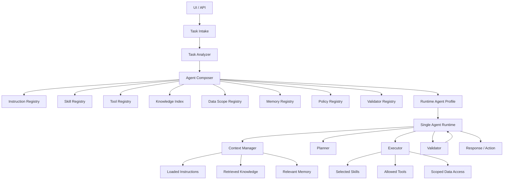

# Architecture

## Product Shape

The system is a skill-centric single-agent runtime. It does not become a multi-agent system by default. Instead, each user task is analyzed and converted into a task-specific `Runtime Agent Profile`.

The profile defines what the runtime may use for that task:

- instructions,
- skills,
- tools,
- knowledge scopes,
- data scopes,
- memory scopes,
- policies,
- validators,
- execution limits.

## Canonical Flow

## Component Responsibilities

`Task Intake` normalizes user/API input, attachments, environment, repository state, and explicit constraints.

`Task Analyzer` classifies task type, risk, domain, missing information, and likely required capabilities.

`Agent Composer` selects and scores candidate modules, applies policies, and builds the runtime profile.

`Runtime Agent Profile` is the task-local execution contract. It should be treated as immutable for a single execution attempt. Recomposition creates a new profile version.

`Single Agent Runtime` executes the task through context management, planning, execution, validation, and response.

`Context Manager` loads only relevant instructions, knowledge, memory, and prior tool results.

`Planner` creates and revises the task plan inside profile constraints.

`Executor` invokes selected skills, allowed tools, and scoped data access.

`Validator` checks output contracts, policy compliance, unauthorized access, and task completion.

## Core Invariant

Self-assembly is controlled. The system may dynamically compose a runtime profile, but capability selection must go through registries, scoring, policies, and validators. Free-form prompt text may explain behavior, but it must not be the sole authority for granting capabilities.
