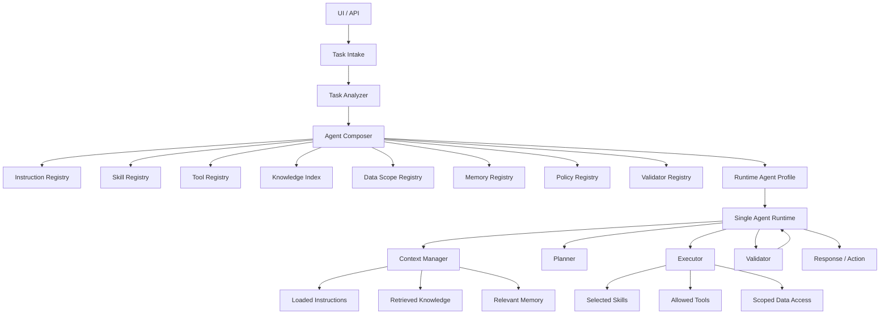

# Architecture

## Product Shape

The system is a skill-centric single-agent runtime. It does not become a multi-agent system by default. Instead, each user task is analyzed and converted into a task-specific `Runtime Agent Profile`.

The profile defines what the runtime may use for that task:

- instructions,
- skills,
- tools,
- knowledge scopes,
- data scopes,
- memory scopes,
- policies,
- validators,
- execution limits,
- failure policy,
- observability settings.

## Canonical Flow

## Component Responsibilities

`Task Intake` normalizes user/API input, attachments, environment, repository state, explicit constraints, and submitter identity into a task envelope.

`Task Analyzer` converts the task envelope into structured task signals: task type, risk level, domains, required inputs, available inputs, capability hints, constraints, missing information, and auth claims. It may use rules, classifiers, or LLM assistance, but its output must be explicit and testable.

`Agent Composer` queries registries, scores candidate modules, applies policies, validates the dependency graph, pins module versions, and emits a runtime profile. It does not load broad capabilities by default.

`Runtime Agent Profile` is the task-local execution contract. It is immutable for a single execution attempt. Recomposition creates a new profile generation with a parent profile reference and reason.

`Single Agent Runtime` executes the task through context management, planning, execution, validation, and response. It cannot grant itself tools, data, memory, or knowledge outside the profile.

`Context Manager` loads only relevant instructions, knowledge, memory, and prior tool results allowed by the profile.

`Planner` creates and revises the task plan inside profile constraints and budgets.

`Executor` invokes selected skills, allowed tools, and scoped data access. Every invocation must be checked against profile permissions and remaining limits.

`Validator` checks profile integrity before execution, then output contracts, policy compliance, unauthorized access, and task completion before final response or action.

## Composition Pipeline

The Composer is a deterministic pipeline around model-assisted analysis, not a free-form prompt:

1. Read analyzer output and task constraints.
2. Discover candidates from typed registries.
3. Score candidates against structured signals.
4. Remove denied candidates through policy and authz filters.
5. Resolve dependencies and pinned versions.
6. Validate the candidate graph.
7. Emit a runtime profile.
8. Validate the profile schema and cross-field invariants.

The runtime receives only the validated profile. If execution needs a capability that is not present, it requests recomposition instead of expanding permissions locally.

## Core Invariant

Self-assembly is controlled. Capability selection must go through registries, scoring, policies, graph validation, and profile validation. Free-form prompt text may explain behavior, but it must not be the sole authority for granting capabilities.

## Operational Baseline

Auth/authz, failure semantics, and observability are part of the architecture from the start:

- Every composition uses an explicit principal, roles, and authorization policies.
- Unsafe ambiguity fails closed or requests clarification.
- Every profile defines trace settings and required event capture.
- Limits cover tool calls, tokens, duration, data reads, memory operations, and recomposition count.
