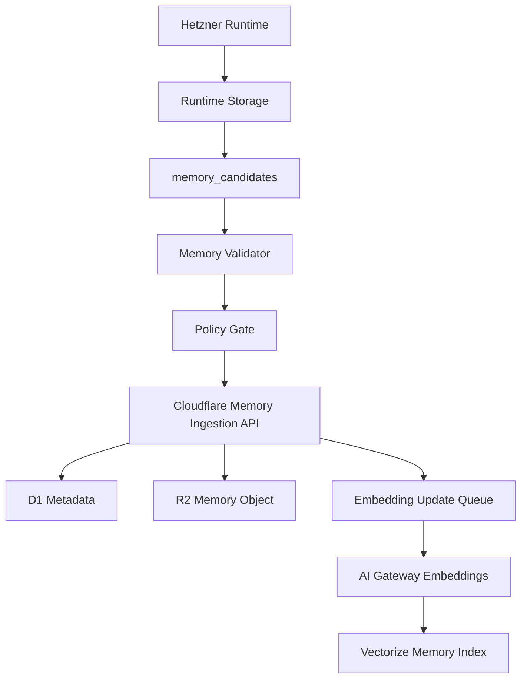

# Infrastructure Boundary

## Purpose

This document defines where persistent data lives.

The system has two infrastructure planes:

- Cloudflare Control Plane for stable, non-runtime composition data.
- Hetzner Runtime Plane for task-local execution results and artifacts.

Runtime outputs can produce long-term memory, but only through a validated feedback loop.
Environment-specific resource names and secret prefixes are defined in
`docs/environment-separation.md` and
`examples/infrastructure/environment-manifest.json`.

## Plane Ownership

| Plane | Owns | Does Not Own |
| --- | --- | --- |
| Cloudflare Control Plane | Registries, policies, scope metadata, knowledge catalog, consolidated memory, semantic indexes, ingestion state | Raw runtime traces, raw tool outputs, run logs, execution artifacts |
| Hetzner Runtime Plane | Runtime runs, steps, tool outputs, traces, validation results, artifacts, memory candidates | Registry source of truth, knowledge source of truth, long-term memory source of truth |

## Cloudflare Resources

| Resource | Product | Responsibility |
| --- | --- | --- |
| `scas-control-api-{env}` | Workers | Control API for registry, knowledge, memory, and ingestion |
| `scas-control-{env}` | D1 | Source of truth for structured control metadata |
| `scas-knowledge-{env}` | R2 | Raw and normalized knowledge objects, chunks, manifests |
| `scas-memory-{env}` | R2 | Consolidated memory objects and manifests |
| `scas-knowledge-{env}` | Vectorize | Knowledge embeddings |
| `scas-memory-{env}` | Vectorize | Memory embeddings |
| `scas-config-{env}` | KV | Versioned cache snapshots and non-sensitive config |
| `scas-ingest-{env}` | Queues | Async embedding updates and re-indexing |

`{env}` is one of `dev`, `staging`, or `prod`.

## Cloudflare D1 Metadata

The machine-readable recordset contract lives in `schemas/cloudflare-control-plane.schema.json`.

The executable D1 migrations live in `migrations/cloudflare/d1/`.

Initial D1 tables should cover:

- `modules`
- `module_versions`
- `module_dependencies`
- `knowledge_sources`
- `knowledge_documents`
- `knowledge_chunks`
- `memory_records`
- `scope_bindings`
- `policy_bindings`
- `ingestion_jobs`
- `audit_events`

`audit_events` must have retention and archival. It is not a permanent high-volume event stream.

## R2 Key Conventions

Knowledge objects:

```text
knowledge/
  {source_id}/
    {document_id}/
      v{version}/
        raw.{ext}
        normalized.md
        chunks.jsonl
        manifest.json
```

Memory objects:

```text
memory/
  {memory_scope}/
    {record_id}/
      v{version}/
        content.json
        manifest.json
```

Audit archive objects:

```text
audit/
  {yyyy}/
    {mm}/
      {dd}/
        audit-events-{shard}.jsonl
```

## Hetzner Runtime Storage

The machine-readable recordset contract lives in `schemas/hetzner-runtime-plane.schema.json`.

The executable PostgreSQL migrations live in `migrations/hetzner/postgres/`.

The Hetzner runtime plane starts with structured runtime storage and artifact
storage. The default server bootstrap target is:

- Database: `scas_runtime`
- PostgreSQL owner role: `scas_runtime_app`
- PostgreSQL schema: `runtime`
- Artifact root: `/opt/scas/runtime`

Postgres tables:

- `runtime_runs`
- `runtime_steps`
- `runtime_events`
- `runtime_checkpoints`
- `tool_invocations`
- `validation_results`
- `memory_candidates`

Artifact paths:

```text
/opt/scas/runtime/
  artifacts/
  tool_outputs/
  traces/
  logs/
  tmp/
```

The runtime writes raw outputs and traces only to Hetzner. Cloudflare receives only approved memory records derived from those outputs.

Runtime events follow the Flight Recorder pattern:

- `runtime_events` is append-only per run and deduplicated by idempotency key.
- Runtime event indexes are allocated through the runtime store, not by
  counting currently visible events. The PostgreSQL adapter locks the
  `runtime_runs` row before computing the next run-local index.
- `event_type`, `actor_role`, and `stop_reason` use constrained vocabularies.
- planned action, execution, and result payloads are stored by artifact URI
  (`planned_action_uri`, `execution_uri`, `result_uri`), not inline JSON.
- `runtime_checkpoints` stores phase snapshots; `step_id` is nullable for
  checkpoints between runtime phases.
- Token budget and token usage are tracked on runs and steps.
- The first Python Flight Recorder writer writes event/checkpoint payloads to a
  JSON artifact store and persists only URIs into runtime event rows.
- Large string payloads are persisted as chunked text artifacts with a manifest
  reference in the parent JSON artifact.
- Artifact writes honor the Runtime Agent Profile's
  `observability.redact_sensitive_data` flag.
- Runtime retention planning separates expired artifact URIs from retained
  records before cleanup deletes data.
- Runtime retention cleanup resolves only `hetzner://runtime/...` URIs under
  the configured Hetzner artifact root, defaults to dry-run behavior, reports
  missing files deterministically, and never deletes runtime metadata rows in
  the first cleanup slice.

Productive runtime work may only begin after the Runtime Preflight Gate in
`docs/runtime-preflight.md` confirms that the dev Worker, D1, R2, Vectorize,
Hetzner PostgreSQL, artifact root, secrets, and CI are in a known state.

## Memory Feedback Loop



Rules:

- Raw runtime logs do not cross into Cloudflare.
- Raw tool outputs do not cross into Cloudflare.
- A memory candidate must identify its source run and profile.
- A memory candidate must declare target memory scope, sensitivity, retention, and policy result.
- A validator must approve the candidate before ingestion.
- Validation and policy decisions are stored on the candidate as status fields
  and reason text before the feedback client can submit it.
- Cloudflare stores the consolidated memory object and retrieval metadata.
- Embedding updates are asynchronous. The ingestion response records an
  `embedding_update` job ID; D1 and R2 are authoritative even while Vectorize
  population is still queued, retrying, or failed.

## Composer Control API Flow

The Composer should use batched Control API calls to reduce cross-cloud latency:

```text
POST /composition/context
  analyzer_output
  requested_profile_generation
  principal
  constraints

returns:
  registry_version
  candidate_modules
  applicable_policies
  allowed_knowledge_scopes
  allowed_data_scopes
  allowed_memory_scopes
  validation_requirements
  policy_decisions
  graph_validation
```

The endpoint reads module versions, structured selection metadata,
dependencies, policy bindings, and principal scope bindings from D1. KV may
provide non-authoritative configuration such as `registry:version`, but
policy-sensitive or stale cache paths must fall back to D1.

The Control API Worker lives in `workers/control-api/`. Its bootstrap and
deployment runbook lives in `docs/cloudflare/control-api.md`.

Runtime context retrieval uses a separate bounded endpoint:

```text
POST /retrieval/context
  principal
  query
  optional query_embedding
  requested knowledge_scope_ids
  requested memory_scope_ids
  top_k

returns:
  allowed_knowledge_scope_ids
  allowed_memory_scope_ids
  knowledge_chunks
  memory_records
  vectorize_matches
```

Without `query_embedding`, the endpoint returns a D1-prefiltered retrieval
context and no semantic matches. With `query_embedding`, Vectorize ranks
candidate IDs and D1 post-validates every returned match.
Because embedding population is asynchronous, retrieval callers must tolerate
D1-authorized records that do not yet have a Vectorize match.

## Vector Search Flow

Knowledge and memory search must combine D1 and Vectorize:

1. D1 computes allowed IDs by scope, policy, version, domain, and sensitivity.
2. Vectorize performs semantic retrieval.
3. D1 post-validates returned IDs.
4. The Context Manager receives only validated items.

Vectorize is not the policy engine.

## Secrets

GitHub repository secrets are used for deployment:

- `CLOUDFLARE_ACCOUNT_ID`
- `CLOUDFLARE_API_TOKEN`
- `CLOUDFLARE_ZONE_ID`
- `HETZNER_HOST`
- `HETZNER_SSH_KEY`
- `HETZNER_USER`
- `OPENAI_API_KEY`
- `AI_GATEWAY_AUTH_TOKEN` when Cloudflare Authenticated Gateway is enabled
- `CONTROL_API_TOKEN`

Workers receive runtime secrets through Cloudflare Worker Secrets or
account-level secret bindings. `OPENAI_API_KEY` is used as the OpenAI provider
key through AI Gateway in production and must not be committed to configuration
files. `AI_GATEWAY_AUTH_TOKEN` is a separate Cloudflare Authenticated Gateway
token and is forwarded as `cf-aig-authorization` when that gateway mode is
enabled.

The GitHub Actions `CLOUDFLARE_API_TOKEN` used for dev Worker rollout must
allow Worker script writes on the target account. The live AI Gateway smoke
deployment uploads Worker code and Worker secrets through Wrangler, so a
read-only token can validate account connectivity but cannot complete the
rollout.

The Control API Worker requires bearer-token secrets for every non-health
route. Endpoint-scoped secrets are:

- `CONTROL_API_COMPOSITION_TOKEN`
- `CONTROL_API_INGESTION_TOKEN`
- `CONTROL_API_RETRIEVAL_TOKEN`
- `CONTROL_API_AI_GATEWAY_TOKEN`

`CONTROL_API_TOKEN` may be used as an all-scope automation token when endpoint
scoping is impractical.

The GitHub Actions workflow at `.github/workflows/ci.yml` validates these secret
bindings through a manual infrastructure smoke test. The smoke test checks the
Cloudflare API token, OpenAI secret presence, and SSH connectivity to Hetzner. It
is not run automatically on pull requests or pushes.

## Current Implementation Status

Implemented:

- ADR-0004 records the Cloudflare/Hetzner boundary.
- ADR-0005 records the Runtime Flight Recorder decision.
- This infrastructure boundary document defines ownership and data flow.
- Cloudflare D1 schema contract and migrations exist.
- Hetzner runtime storage schema contract, PostgreSQL migration, and bootstrap
  script exist.
- Hetzner runtime observability migration exists for runtime events,
  checkpoints, stop reasons, token budgets, and idempotency keys.
- Wrangler configuration exists for the dev Control API Worker.
- `POST /composition/context` is implemented in `workers/control-api/`.
- The Control API Worker requires bearer authentication on every non-health
  endpoint and supports endpoint-scoped tokens.
- Dev D1 registry seed generation exists in
  `scripts/cloudflare/generate_control_plane_seed.py`.
- The dev Worker and remote dev D1 have been smoke-tested with a real
  `git-diff-analysis` candidate.
- The dev registry seed includes first-slice modules for `code-review`,
  `research`, `task-execution`, and `general-task`; the live gate workflow can
  reseed dev D1 before running the generic runtime suite.
- Python Task Analyzer and Profile Composer integration exists for code-review,
  research, task-execution, and general task evaluation cases and the Control
  Plane response contract.
- Runtime Entry Point exists for Analyzer -> Control API context -> Composer ->
  run creation, with an in-memory runtime store and artifact-backed Flight
  Recorder writer.
- Runtime CLI storage can switch between in-memory fixture storage and
  PostgreSQL-backed Hetzner Runtime Plane storage through
  `SCAS_RUNTIME_DATABASE_URL`.
- Runtime Profile Enforcement fail-closes unselected tools/scopes and exhausted
  tool, token, duration, data-read, memory-op, and recomposition budgets.
- Hardened profile-scoped Tool Gateway exists for `git-read`,
  `filesystem-read`, `filesystem-list`, and `test-runner`, with risk gating,
  blocked argument checks, timeouts, output limits, and access audit events.
- Runtime Context Manager calls `POST /retrieval/context` for bounded
  knowledge/memory context and rejects responses with scopes outside the active
  profile.
- Runtime Validator Framework runs the validator IDs selected by the active
  profile and fail-closes unknown or failed validators.
- Controlled recomposition emits `recomposition_requested`, stops the current
  run with `needs_recomposition`, composes a new immutable profile generation,
  and continues through a new run attempt without mutating the active profile.
- Manual live dev E2E gate script runs Cloudflare composition/retrieval and
  Hetzner PostgreSQL/artifact persistence in one path.
- Operations runbook defines migrations, smoke tests, diagnostics, environment
  separation, and disable paths.
- Minimal Runtime Loop exists for context, planner, executor, and validator
  phases against first-slice strategies for `code-review`, `research`,
  `task-execution`, and `general-task`.
- Runtime redaction policy, retention planner, safe artifact URI resolver,
  cleanup executor, cleanup report, and dry-run-first CLI exist for runtime
  artifacts.
- Cloudflare Control API knowledge and memory ingestion endpoints write R2
  objects, D1 metadata, ingestion jobs, and audit events.
- Hetzner Memory Feedback Pipeline client submits only validator-approved and
  policy-approved memory candidates to Cloudflare.
- Hetzner Memory Candidate Extractor and Validator create candidates only from
  completed runtime steps and record validation/policy reasons for approved and
  rejected candidates.
- Cloudflare Control API retrieval endpoint returns D1-gated knowledge and
  memory context with Vectorize bindings and D1 post-validation.
- Cloudflare Control API ingestion queues deterministic `embedding_update`
  jobs through `SCAS_INGEST_QUEUE`.
- The Control API queue consumer processes knowledge and memory embedding jobs,
  calls OpenAI embeddings through Cloudflare AI Gateway, upserts scoped vectors
  into Vectorize, updates D1 job state, and writes terminal audit events.
- Cloudflare Control API AI Gateway route proxies OpenAI chat completions only
  when the account configuration and `OPENAI_API_KEY` secret are present; when
  `AI_GATEWAY_AUTH_TOKEN` is configured it is sent as Cloudflare gateway auth
  separate from provider auth.
- Manual GitHub Actions rollout uploads `OPENAI_API_KEY`, optional
  `AI_GATEWAY_AUTH_TOKEN`, and `CONTROL_API_TOKEN` as Worker secrets during
  deploy, injects AI Gateway account configuration at deploy time, and can run
  a live AI Gateway smoke without committing secrets.
- Composition scoring evaluation fixtures cover positive and negative scoring
  evidence across code-review and project-memory task signals.
- Runtime output contracts exist for `code-review`, `research`,
  `task-execution`, and `general-task`, with profile-selected validators.
- The first production skill handler runtime slice resolves selected skills to
  exact `name@version` executable handlers and fails closed on unknown or
  mismatched handler bindings.
- A committed skill handler coverage manifest maps each production-required
  skill fixture to its handler ID, runtime path, module tests, and runtime
  tests; CI fails if the manifest is stale or a required handler is missing.
- The live runtime gate emits sanitized handler-binding evidence from planner
  checkpoints and uploads it as a GitHub Actions artifact for production
  certification.
- Handler upgrades, deprecations, and rollback are governed by a repository
  policy that preserves immutable profile version pins and fail-closed rollback
  behavior.
- Scheduled runtime retention cleanup runs on the Hetzner Runtime Plane through
  a dry-run-first GitHub Actions workflow and uploads non-secret cleanup
  evidence.
- Aggregate production telemetry policy and snapshots cover Control Plane and
  Runtime Plane alert signals without moving raw traces out of Hetzner.
- Production security closure validates the threat model, token-scope review,
  secret rotation expectations, and data-plane boundary evidence.
- Analyzer and Composer human-review quality gates turn ambiguous tasks into
  review-required profiles without selected specialized capabilities.
- GitHub Actions runs contract tests, linting, JSON validation, Worker tests,
  Worker type checks, and Worker dry-run deploys.

Not yet implemented:

- Provisioned staging and production Cloudflare/Hetzner resources. The
  environment separation manifest and documentation exist, but resources still
  need to be created and validated.
- Production release certification run against staging and production live
  infrastructure. The evidence workflow can verify external live run metadata,
  but the final certification gate remains pending.
- Broader production skill handler coverage beyond the current manifest-covered
  fixture set.

## Implementation Order

Completed:

1. ADR-0004.
2. This infrastructure boundary document.
3. Roadmap update.
4. D1 schema contract and migrations.
5. Hetzner runtime storage contract and bootstrap script.
6. Wrangler configuration.
7. Cloudflare Control API Worker scaffold and composition context contract.
8. GitHub Actions deployment and validation.
9. D1 registry seed generation and remote dev seed smoke test.
10. Initial Task Analyzer and Profile Composer.
11. Runtime Flight Recorder storage contract.
12. Runtime Entry Point and Flight Recorder writer.
13. Profile-scoped Tool Gateway and Minimal Runtime Loop.
14. Cloudflare knowledge and memory ingestion endpoints.
15. Vectorize-ready retrieval endpoint and AI Gateway route.
16. Memory Candidate Extraction, Validation, and controlled learning fixture.
17. Runtime storage session for PostgreSQL-backed Hetzner execution.
18. Runtime Profile Enforcement for selected capabilities and profile budgets.
19. Tool Gateway hardening for productive runtime execution.
20. Runtime Context Manager binding to the Control API retrieval endpoint.
21. Runtime Validator Framework driven by profile-selected validators.
22. Controlled recomposition continuation path without runtime self-granting.
23. Manual live dev E2E gate script for Cloudflare and Hetzner.
24. Operations runbook for migrations, smoke tests, diagnostics, and disable paths.
25. Control API bearer authentication and endpoint-scoped authorization.
26. Atomic Flight Recorder event-index allocation.
27. Analyzer and scoring evaluation fixtures.
28. Chunked runtime artifact payload persistence.
29. AI Gateway secret rollout and live LLM smoke workflow.
30. Queue-backed embedding indexing worker and Vectorize population path.
31. Runtime retention cleanup execution.
32. Generic runtime strategy dispatch and task-class output contracts.
33. Extended live dev E2E and retrieval/Vectorize smoke gates.
34. Production release evidence workflow with same-repository, same-commit
    external run metadata validation.
35. Production skill handler runtime first slice with version-pinned built-in
    handlers.
36. Skill handler coverage manifest and CI gate for current production-required
    skill fixtures.
37. Live handler-binding evidence artifact and production-readiness validation.
38. Skill handler version upgrade and rollback policy.
39. Controlled write-capable execution path.
40. Scheduled runtime retention cleanup automation.
41. Production telemetry and alerting policy with aggregate snapshot evaluation.
42. Production security hardening and threat model closure.
43. Analyzer, Composer, and human-review quality gate.

Next:

1. Provision and validate staging/prod resources from the environment manifest.
2. Expand production skill handler coverage beyond the current manifest-covered
   fixture set.
3. Run the final certification after live infrastructure and handler coverage
   gates are complete.
