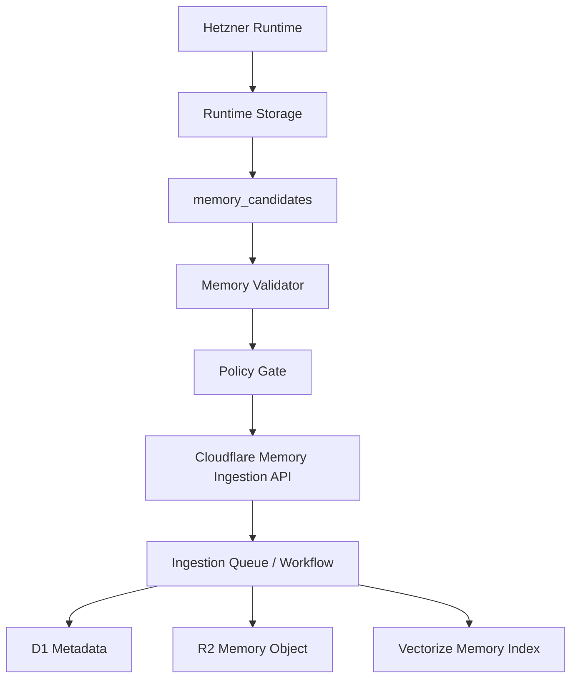

# Infrastructure Boundary

## Purpose

This document defines where persistent data lives.

The system has two infrastructure planes:

- Cloudflare Control Plane for stable, non-runtime composition data.
- Hetzner Runtime Plane for task-local execution results and artifacts.

Runtime outputs can produce long-term memory, but only through a validated feedback loop.

## Plane Ownership

| Plane | Owns | Does Not Own |
| --- | --- | --- |
| Cloudflare Control Plane | Registries, policies, scope metadata, knowledge catalog, consolidated memory, semantic indexes, ingestion state | Raw runtime traces, raw tool outputs, run logs, execution artifacts |
| Hetzner Runtime Plane | Runtime runs, steps, tool outputs, traces, validation results, artifacts, memory candidates | Registry source of truth, knowledge source of truth, long-term memory source of truth |

## Cloudflare Resources

| Resource | Product | Responsibility |
| --- | --- | --- |
| `scas-control-api-{env}` | Workers | Control API for registry, knowledge, memory, and ingestion |
| `scas-control-{env}` | D1 | Source of truth for structured control metadata |
| `scas-knowledge-{env}` | R2 | Raw and normalized knowledge objects, chunks, manifests |
| `scas-memory-{env}` | R2 | Consolidated memory objects and manifests |
| `scas-knowledge-{env}` | Vectorize | Knowledge embeddings |
| `scas-memory-{env}` | Vectorize | Memory embeddings |
| `scas-config-{env}` | KV | Versioned cache snapshots and non-sensitive config |
| `scas-ingest-{env}` | Queues or Workflows | Async ingestion and re-indexing |

`{env}` is one of `dev`, `staging`, or `prod`.

## Cloudflare D1 Metadata

The machine-readable recordset contract lives in `schemas/cloudflare-control-plane.schema.json`.

The initial executable D1 migration lives in
`migrations/cloudflare/d1/0001_control_plane.sql`.

Initial D1 tables should cover:

- `modules`
- `module_versions`
- `module_dependencies`
- `knowledge_sources`
- `knowledge_documents`
- `knowledge_chunks`
- `memory_records`
- `scope_bindings`
- `policy_bindings`
- `ingestion_jobs`
- `audit_events`

`audit_events` must have retention and archival. It is not a permanent high-volume event stream.

## R2 Key Conventions

Knowledge objects:

```text
knowledge/
  {source_id}/
    {document_id}/
      v{version}/
        raw.{ext}
        normalized.md
        chunks.jsonl
        manifest.json
```

Memory objects:

```text
memory/
  {memory_scope}/
    {record_id}/
      v{version}/
        content.json
        manifest.json
```

Audit archive objects:

```text
audit/
  {yyyy}/
    {mm}/
      {dd}/
        audit-events-{shard}.jsonl
```

## Hetzner Runtime Storage

The machine-readable recordset contract lives in `schemas/hetzner-runtime-plane.schema.json`.

The Hetzner runtime plane should start with structured runtime storage and artifact storage.

Postgres tables:

- `runtime_runs`
- `runtime_steps`
- `tool_invocations`
- `validation_results`
- `memory_candidates`

Artifact paths:

```text
artifacts/
tool_outputs/
traces/
logs/
```

The runtime writes raw outputs and traces only to Hetzner. Cloudflare receives only approved memory records derived from those outputs.

## Memory Feedback Loop



Rules:

- Raw runtime logs do not cross into Cloudflare.
- Raw tool outputs do not cross into Cloudflare.
- A memory candidate must identify its source run and profile.
- A memory candidate must declare target memory scope, sensitivity, retention, and policy result.
- A validator must approve the candidate before ingestion.
- Cloudflare stores the consolidated memory object and retrieval metadata.

## Composer Control API Flow

The Composer should use batched Control API calls to reduce cross-cloud latency:

```text
POST /composition/context
  analyzer_output
  requested_profile_generation
  principal
  constraints

returns:
  registry_version
  candidate_modules
  applicable_policies
  allowed_knowledge_scopes
  allowed_memory_scopes
  validation_requirements
```

The endpoint may use KV snapshots for fast reads, but D1 is authoritative. Policy-sensitive or stale cache paths must fall back to D1.

## Vector Search Flow

Knowledge and memory search must combine D1 and Vectorize:

1. D1 computes allowed IDs by scope, policy, version, domain, and sensitivity.
2. Vectorize performs semantic retrieval.
3. D1 post-validates returned IDs.
4. The Context Manager receives only validated items.

Vectorize is not the policy engine.

## Secrets

GitHub repository secrets are used for deployment:

- `CLOUDFLARE_ACCOUNT_ID`
- `CLOUDFLARE_API_TOKEN`
- `CLOUDFLARE_ZONE_ID`
- `OPENAI_API_KEY`

Workers receive runtime secrets through Cloudflare Worker Secrets or account-level secret bindings. `OPENAI_API_KEY` is used through AI Gateway in production and must not be committed to configuration files.

## Implementation Order

1. ADR-0004.
2. This infrastructure boundary document.
3. Roadmap update.
4. D1 schema contract.
5. Hetzner runtime storage contract.
6. Wrangler configuration.
7. GitHub Actions deployment and validation.
