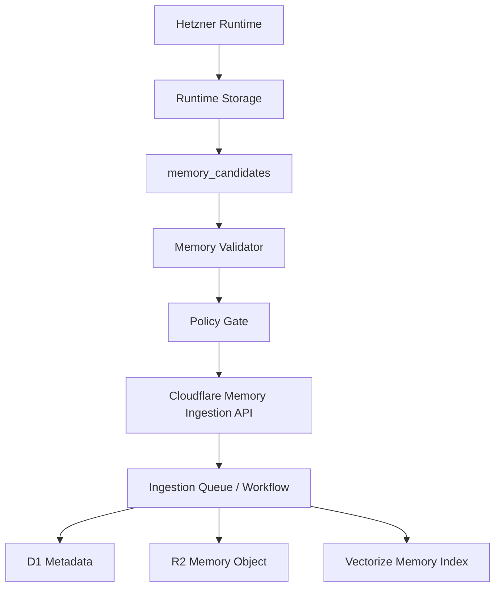

# Infrastructure Boundary

## Purpose

This document defines where persistent data lives.

The system has two infrastructure planes:

- Cloudflare Control Plane for stable, non-runtime composition data.
- Hetzner Runtime Plane for task-local execution results and artifacts.

Runtime outputs can produce long-term memory, but only through a validated feedback loop.

## Plane Ownership

| Plane | Owns | Does Not Own |
| --- | --- | --- |
| Cloudflare Control Plane | Registries, policies, scope metadata, knowledge catalog, consolidated memory, semantic indexes, ingestion state | Raw runtime traces, raw tool outputs, run logs, execution artifacts |
| Hetzner Runtime Plane | Runtime runs, steps, tool outputs, traces, validation results, artifacts, memory candidates | Registry source of truth, knowledge source of truth, long-term memory source of truth |

## Cloudflare Resources

| Resource | Product | Responsibility |
| --- | --- | --- |
| `scas-control-api-{env}` | Workers | Control API for registry, knowledge, memory, and ingestion |
| `scas-control-{env}` | D1 | Source of truth for structured control metadata |
| `scas-knowledge-{env}` | R2 | Raw and normalized knowledge objects, chunks, manifests |
| `scas-memory-{env}` | R2 | Consolidated memory objects and manifests |
| `scas-knowledge-{env}` | Vectorize | Knowledge embeddings |
| `scas-memory-{env}` | Vectorize | Memory embeddings |
| `scas-config-{env}` | KV | Versioned cache snapshots and non-sensitive config |
| `scas-ingest-{env}` | Queues or Workflows | Async ingestion and re-indexing |

`{env}` is one of `dev`, `staging`, or `prod`.

## Cloudflare D1 Metadata

The machine-readable recordset contract lives in `schemas/cloudflare-control-plane.schema.json`.

The executable D1 migrations live in `migrations/cloudflare/d1/`.

Initial D1 tables should cover:

- `modules`
- `module_versions`
- `module_dependencies`
- `knowledge_sources`
- `knowledge_documents`
- `knowledge_chunks`
- `memory_records`
- `scope_bindings`
- `policy_bindings`
- `ingestion_jobs`
- `audit_events`

`audit_events` must have retention and archival. It is not a permanent high-volume event stream.

## R2 Key Conventions

Knowledge objects:

```text
knowledge/
  {source_id}/
    {document_id}/
      v{version}/
        raw.{ext}
        normalized.md
        chunks.jsonl
        manifest.json
```

Memory objects:

```text
memory/
  {memory_scope}/
    {record_id}/
      v{version}/
        content.json
        manifest.json
```

Audit archive objects:

```text
audit/
  {yyyy}/
    {mm}/
      {dd}/
        audit-events-{shard}.jsonl
```

## Hetzner Runtime Storage

The machine-readable recordset contract lives in `schemas/hetzner-runtime-plane.schema.json`.

The executable PostgreSQL migrations live in `migrations/hetzner/postgres/`.

The Hetzner runtime plane starts with structured runtime storage and artifact
storage. The default server bootstrap target is:

- Database: `scas_runtime`
- PostgreSQL owner role: `scas_runtime_app`
- PostgreSQL schema: `runtime`
- Artifact root: `/opt/scas/runtime`

Postgres tables:

- `runtime_runs`
- `runtime_steps`
- `runtime_events`
- `runtime_checkpoints`
- `tool_invocations`
- `validation_results`
- `memory_candidates`

Artifact paths:

```text
/opt/scas/runtime/
  artifacts/
  tool_outputs/
  traces/
  logs/
  tmp/
```

The runtime writes raw outputs and traces only to Hetzner. Cloudflare receives only approved memory records derived from those outputs.

Runtime events follow the Flight Recorder pattern:

- `runtime_events` is append-only per run and deduplicated by idempotency key.
- `event_type`, `actor_role`, and `stop_reason` use constrained vocabularies.
- planned action, execution, and result payloads are stored by artifact URI
  (`planned_action_uri`, `execution_uri`, `result_uri`), not inline JSON.
- `runtime_checkpoints` stores phase snapshots; `step_id` is nullable for
  checkpoints between runtime phases.
- Token budget and token usage are tracked on runs and steps.
- The first Python Flight Recorder writer writes event/checkpoint payloads to a
  JSON artifact store and persists only URIs into runtime event rows.
- Artifact writes honor the Runtime Agent Profile's
  `observability.redact_sensitive_data` flag.
- Runtime retention planning separates expired artifact URIs from retained
  records before any cleanup job deletes data.

## Memory Feedback Loop



Rules:

- Raw runtime logs do not cross into Cloudflare.
- Raw tool outputs do not cross into Cloudflare.
- A memory candidate must identify its source run and profile.
- A memory candidate must declare target memory scope, sensitivity, retention, and policy result.
- A validator must approve the candidate before ingestion.
- Cloudflare stores the consolidated memory object and retrieval metadata.

## Composer Control API Flow

The Composer should use batched Control API calls to reduce cross-cloud latency:

```text
POST /composition/context
  analyzer_output
  requested_profile_generation
  principal
  constraints

returns:
  registry_version
  candidate_modules
  applicable_policies
  allowed_knowledge_scopes
  allowed_data_scopes
  allowed_memory_scopes
  validation_requirements
  policy_decisions
  graph_validation
```

The endpoint reads module versions, structured selection metadata,
dependencies, policy bindings, and principal scope bindings from D1. KV may
provide non-authoritative configuration such as `registry:version`, but
policy-sensitive or stale cache paths must fall back to D1.

The Control API Worker lives in `workers/control-api/`. Its bootstrap and
deployment runbook lives in `docs/cloudflare/control-api.md`.

## Vector Search Flow

Knowledge and memory search must combine D1 and Vectorize:

1. D1 computes allowed IDs by scope, policy, version, domain, and sensitivity.
2. Vectorize performs semantic retrieval.
3. D1 post-validates returned IDs.
4. The Context Manager receives only validated items.

Vectorize is not the policy engine.

## Secrets

GitHub repository secrets are used for deployment:

- `CLOUDFLARE_ACCOUNT_ID`
- `CLOUDFLARE_API_TOKEN`
- `CLOUDFLARE_ZONE_ID`
- `HETZNER_HOST`
- `HETZNER_SSH_KEY`
- `HETZNER_USER`
- `OPENAI_API_KEY`

Workers receive runtime secrets through Cloudflare Worker Secrets or account-level secret bindings. `OPENAI_API_KEY` is used through AI Gateway in production and must not be committed to configuration files.

The GitHub Actions workflow at `.github/workflows/ci.yml` validates these secret
bindings through a manual infrastructure smoke test. The smoke test checks the
Cloudflare API token, OpenAI secret presence, and SSH connectivity to Hetzner. It
is not run automatically on pull requests or pushes.

## Current Implementation Status

Implemented:

- ADR-0004 records the Cloudflare/Hetzner boundary.
- ADR-0005 records the Runtime Flight Recorder decision.
- This infrastructure boundary document defines ownership and data flow.
- Cloudflare D1 schema contract and migrations exist.
- Hetzner runtime storage schema contract, PostgreSQL migration, and bootstrap
  script exist.
- Hetzner runtime observability migration exists for runtime events,
  checkpoints, stop reasons, token budgets, and idempotency keys.
- Wrangler configuration exists for the dev Control API Worker.
- `POST /composition/context` is implemented in `workers/control-api/`.
- Dev D1 registry seed generation exists in
  `scripts/cloudflare/generate_control_plane_seed.py`.
- The dev Worker and remote dev D1 have been smoke-tested with a real
  `git-diff-analysis` candidate.
- Python Task Analyzer and Profile Composer integration exists for the current
  code-review fixture and Control Plane response contract.
- Runtime Entry Point exists for Analyzer -> Control API context -> Composer ->
  run creation, with an in-memory runtime store and artifact-backed Flight
  Recorder writer.
- Profile-scoped Tool Gateway exists for `git-read`, `filesystem-read`, and
  `test-runner`.
- Minimal Runtime Loop exists for context, planner, executor, and validator
  phases against the code-review fixture.
- Runtime redaction policy and retention planner exist for runtime artifacts.
- Cloudflare Control API knowledge and memory ingestion endpoints write R2
  objects, D1 metadata, ingestion jobs, and audit events.
- GitHub Actions runs contract tests, linting, JSON validation, Worker tests,
  Worker type checks, and Worker dry-run deploys.

Not yet implemented:

- Cloudflare knowledge ingestion API and queue/workflow execution.
- Async ingestion queue/workflow execution for knowledge and memory indexing.
- Hetzner-to-Cloudflare memory feedback client integration.
- Vectorize index creation and retrieval flow.
- Production OpenAI routing through AI Gateway.
- Expanded runtime loop beyond the initial code-review fixture.

## Implementation Order

Completed:

1. ADR-0004.
2. This infrastructure boundary document.
3. Roadmap update.
4. D1 schema contract and migrations.
5. Hetzner runtime storage contract and bootstrap script.
6. Wrangler configuration.
7. Cloudflare Control API Worker scaffold and composition context contract.
8. GitHub Actions deployment and validation.
9. D1 registry seed generation and remote dev seed smoke test.
10. Initial Task Analyzer and Profile Composer.
11. Runtime Flight Recorder storage contract.
12. Runtime Entry Point and Flight Recorder writer.
13. Profile-scoped Tool Gateway and Minimal Runtime Loop.
14. Cloudflare knowledge and memory ingestion endpoints.

Next:

1. Hetzner memory feedback client integration.
2. Vectorize and AI Gateway production integration.
