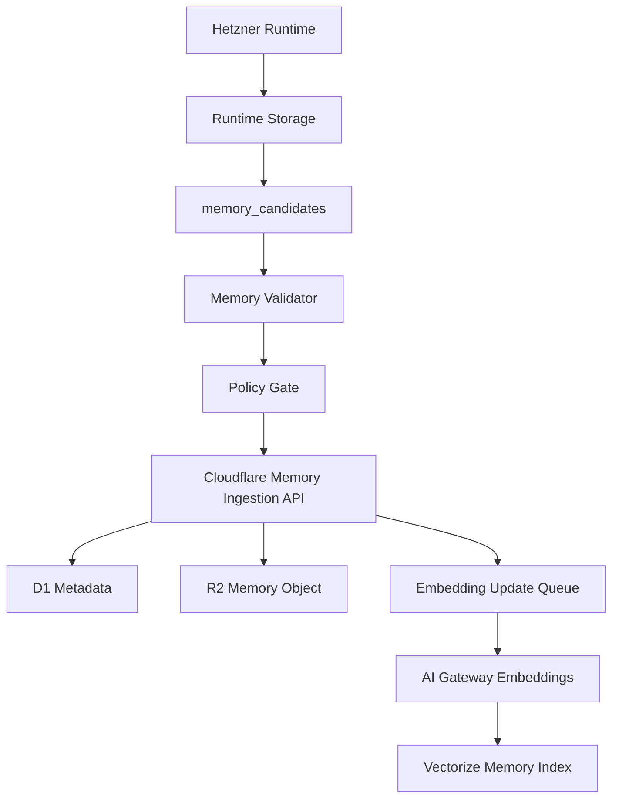

# Infrastructure Boundary

## Purpose

This document defines where persistent data lives.

The system has two infrastructure planes:

- Cloudflare Control Plane for stable, non-runtime composition data.
- Hetzner Runtime Plane for task-local execution results and artifacts.

Runtime outputs can produce long-term memory, but only through a validated feedback loop.
Environment-specific resource names and secret prefixes are defined in
`docs/policies/environment-separation.md` and
`examples/infrastructure/environment-manifest.json`.

## Plane Ownership

| Plane | Owns | Does Not Own |
| --- | --- | --- |
| Cloudflare Control Plane | Registries, policies, scope metadata, knowledge catalog, consolidated memory, semantic indexes, ingestion state | Raw runtime traces, raw tool outputs, run logs, execution artifacts |
| Hetzner Runtime Plane | Runtime runs, steps, tool outputs, traces, validation results, artifacts, memory candidates | Registry source of truth, knowledge source of truth, long-term memory source of truth |

## Cloudflare Resources

| Resource | Product | Responsibility |
| --- | --- | --- |
| `scas-control-api-{env}` | Workers | Control API for registry, knowledge, memory, and ingestion |
| `scas-control-{env}` | D1 | Source of truth for structured control metadata |
| `scas-knowledge-{env}` | R2 | Raw and normalized knowledge objects, chunks, manifests |
| `scas-memory-{env}` | R2 | Consolidated memory objects and manifests |
| `scas-knowledge-{env}` | Vectorize | Knowledge embeddings |
| `scas-memory-{env}` | Vectorize | Memory embeddings |
| `scas-config-{env}` | KV | Versioned cache snapshots and non-sensitive config |
| `scas-ingest-{env}` | Queues | Async embedding updates and re-indexing |

`{env}` is one of `dev`, `staging`, or `prod`.

## Cloudflare D1 Metadata

The machine-readable recordset contract lives in `schemas/cloudflare-control-plane.schema.json`.

The executable D1 migrations live in `migrations/cloudflare/d1/`.

Initial D1 tables should cover:

- `modules`
- `module_versions`
- `module_dependencies`
- `knowledge_sources`
- `knowledge_documents`
- `knowledge_chunks`
- `memory_records`
- `scope_bindings`
- `policy_bindings`
- `ingestion_jobs`
- `audit_events`

`audit_events` must have retention and archival. It is not a permanent high-volume event stream.

## R2 Key Conventions

Knowledge objects:

```text
knowledge/
  {source_id}/
    {document_id}/
      v{version}/
        raw.{ext}
        normalized.md
        chunks.jsonl
        manifest.json
```

Memory objects:

```text
memory/
  {memory_scope}/
    {record_id}/
      v{version}/
        content.json
        manifest.json
```

Audit archive objects:

```text
audit/
  {yyyy}/
    {mm}/
      {dd}/
        audit-events-{shard}.jsonl
```

## Hetzner Runtime Storage

The machine-readable recordset contract lives in `schemas/hetzner-runtime-plane.schema.json`.

The executable PostgreSQL migrations live in `migrations/hetzner/postgres/`.

The Hetzner runtime plane starts with structured runtime storage and artifact
storage. The default server bootstrap target is:

- Database: `scas_runtime`
- PostgreSQL owner role: `scas_runtime_app`
- PostgreSQL schema: `runtime`
- Artifact root: `/opt/scas/runtime`

Postgres tables:

- `runtime_runs`
- `runtime_steps`
- `runtime_events`
- `runtime_checkpoints`
- `tool_invocations`
- `validation_results`
- `memory_candidates`

Artifact paths:

```text
/opt/scas/runtime/
  artifacts/
  tool_outputs/
  traces/
  logs/
  tmp/
```

The runtime writes raw outputs and traces only to Hetzner. Cloudflare receives only approved memory records derived from those outputs.

Runtime events follow the Flight Recorder pattern:

- `runtime_events` is append-only per run and deduplicated by idempotency key.
- Runtime event indexes are allocated through the runtime store, not by
  counting currently visible events. The PostgreSQL adapter locks the
  `runtime_runs` row before computing the next run-local index.
- `event_type`, `actor_role`, and `stop_reason` use constrained vocabularies.
- planned action, execution, and result payloads are stored by artifact URI
  (`planned_action_uri`, `execution_uri`, `result_uri`), not inline JSON.
- `runtime_checkpoints` stores phase snapshots; `step_id` is nullable for
  checkpoints between runtime phases.
- Token budget and token usage are tracked on runs and steps.
- The first Python Flight Recorder writer writes event/checkpoint payloads to a
  JSON artifact store and persists only URIs into runtime event rows.
- Large string payloads are persisted as chunked text artifacts with a manifest
  reference in the parent JSON artifact.
- Artifact writes honor the Runtime Agent Profile's
  `observability.redact_sensitive_data` flag.
- Runtime retention planning separates expired artifact URIs from retained
  records before cleanup deletes data.
- Runtime retention cleanup resolves only `hetzner://runtime/...` URIs under
  the configured Hetzner artifact root, defaults to dry-run behavior, reports
  missing files deterministically, and never deletes runtime metadata rows in
  the first cleanup slice.

Productive runtime work may only begin after the Runtime Preflight Gate in
`docs/runbooks/runtime-preflight.md` confirms that the dev Worker, D1, R2, Vectorize,
Hetzner PostgreSQL, artifact root, secrets, and CI are in a known state.

## Memory Feedback Loop



Rules:

- Raw runtime logs do not cross into Cloudflare.
- Raw tool outputs do not cross into Cloudflare.
- A memory candidate must identify its source run and profile.
- A memory candidate must declare target memory scope, sensitivity, retention, and policy result.
- A validator must approve the candidate before ingestion.
- Validation and policy decisions are stored on the candidate as status fields
  and reason text before the feedback client can submit it.
- Cloudflare stores the consolidated memory object and retrieval metadata.
- Embedding updates are asynchronous. The ingestion response records an
  `embedding_update` job ID; D1 and R2 are authoritative even while Vectorize
  population is still queued, retrying, or failed.

## Composer Control API Flow

The Composer should use batched Control API calls to reduce cross-cloud latency:

```text
POST /composition/context
  analyzer_output
  requested_profile_generation
  principal
  constraints

returns:
  registry_version
  candidate_modules
  applicable_policies
  allowed_knowledge_scopes
  allowed_data_scopes
  allowed_memory_scopes
  validation_requirements
  policy_decisions
  graph_validation
```

The endpoint reads module versions, structured selection metadata,
dependencies, policy bindings, and principal scope bindings from D1. KV may
provide non-authoritative configuration such as `registry:version`, but
policy-sensitive or stale cache paths must fall back to D1.

The Control API Worker lives in `workers/control-api/`. Its bootstrap and
deployment runbook lives in `docs/reference/cloudflare/control-api.md`.

Runtime context retrieval uses a separate bounded endpoint:

```text
POST /retrieval/context
  principal
  query
  optional query_embedding
  requested knowledge_scope_ids
  requested memory_scope_ids
  top_k

returns:
  allowed_knowledge_scope_ids
  allowed_memory_scope_ids
  knowledge_chunks
  memory_records
  vectorize_matches
```

Without `query_embedding`, the endpoint returns a D1-prefiltered retrieval
context and no semantic matches. With `query_embedding`, Vectorize ranks
candidate IDs and D1 post-validates every returned match.
Because embedding population is asynchronous, retrieval callers must tolerate
D1-authorized records that do not yet have a Vectorize match.

## Vector Search Flow

Knowledge and memory search must combine D1 and Vectorize:

1. D1 computes allowed IDs by scope, policy, version, domain, and sensitivity.
2. Vectorize performs semantic retrieval.
3. D1 post-validates returned IDs.
4. The Context Manager receives only validated items.

Vectorize is not the policy engine.

## Secret and Environment Rules

Secret naming, environment prefixes, and cross-environment separation are
normative only in `docs/policies/environment-separation.md`.
This document defines data-plane ownership and flow boundaries, not per-secret
naming policies.

## Operational Tracking Location

Implementation status, sequencing, and backlog tracking are intentionally kept
out of this policy file.
Track those in:

- `docs/runbooks/infrastructure-implementation-status.md`
- `docs/roadmap/production-readiness-backlog.md`

