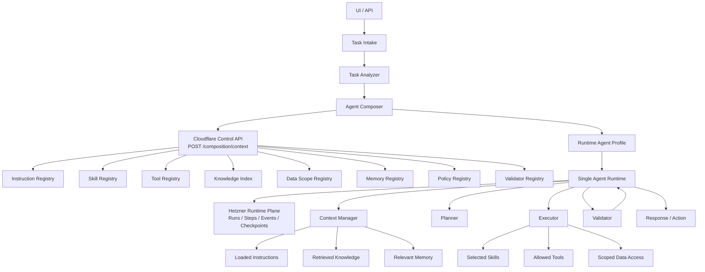

# Architecture

## Product Shape

The system is a skill-centric single-agent runtime. It does not become a multi-agent system by default. Instead, each user task is analyzed and converted into a task-specific `Runtime Agent Profile`.

The profile defines what the runtime may use for that task:

- instructions,
- skills,
- tools,
- knowledge scopes,
- data scopes,
- memory scopes,
- policies,
- validators,
- execution limits,
- failure policy,
- observability settings.

## Canonical Flow

## Component Responsibilities

`Task Intake` normalizes user/API input, attachments, environment, repository state, explicit constraints, and submitter identity into a task envelope.

`Task Analyzer` converts the task envelope into structured task signals: task
type, risk level, domains, required inputs, available inputs, capability hints,
constraints, missing information, auth claims, classification confidence,
classification reasons, ambiguity markers, and human-review requirements. It
may use rules, classifiers, or LLM assistance, but its output must be explicit
and testable. Ambiguous specialized matches fall back to `general-task` rather
than silently choosing the wrong strategy.

`Intent Transition Gate` evaluates multi-turn changes before capability
authority can widen. It consumes typed transition evidence, evidence spans,
previous/current task types, repository binding, write intent, and capability
deltas. Unknown or unverifiable transition facts behave like not authorized for
capability escalation. The durable policy is
`docs/policies/intent-transition-gates.md`.

`Agent Composer` consumes structured task signals and calls the Cloudflare
Control API for D1-backed composition context. It scores candidate modules,
applies policies, validates the dependency graph, pins module versions, and
emits a runtime profile. It does not load broad capabilities by default. If
analyzer output requires human review, it emits a constrained review-required
profile with no specialized skills, tools, or scopes.

`Runtime Agent Profile` is the task-local execution contract. It is immutable
for a single execution attempt. Recomposition creates a new profile generation
with a parent profile reference and reason, then continues through a new run
attempt instead of changing the active profile in place.

`Single Agent Runtime` executes the task through context management, planning,
execution, validation, and response. It cannot grant itself skills, tools, data,
memory, or knowledge outside the profile.

`Context Manager` loads only relevant instructions, knowledge, memory, and prior
tool results allowed by the profile. Knowledge and memory retrieval must go
through the bounded Cloudflare `POST /retrieval/context` endpoint instead of
direct broad store reads.

`Planner` creates and revises the task plan inside profile constraints and
budgets. Executable skill behavior is resolved through the runtime skill handler
registry by exact selected skill name and `module_versions` pin.

`Executor` invokes selected skills, allowed tools, and scoped data access. Every
invocation must be checked against profile permissions and remaining limits.

`Validator` checks profile integrity before execution, then output contracts, policy compliance, unauthorized access, and task completion before final response or action.

`HOOKS` are governed lifecycle hook points across composition and runtime
execution. They may observe, persist sanitized evidence, deny execution, run
selected validators, request human review, or request controlled recomposition.
They must not grant capabilities, mutate the active profile, bypass policy or
validator gates, read unscoped data, execute unregistered tools, write secrets
or raw traces, or change module version pins. The durable policy is
`docs/policies/hooks-usage-model.md`.

`Error Classification` maps runtime outcomes to explicit taxonomy classes
(`F1_INEFFICIENCY_PATH`, `F2_INTERFACE_CONTRACT_BREAKDOWN`,
`R8_POLICY_CONFLICT_CONTEXT_CONTAMINATION`, `NONE`) with deterministic evidence
and runtime playbooks for gates and trend analysis.

## Composition Pipeline

The Composer is a deterministic pipeline around model-assisted analysis, not a free-form prompt:

1. Read analyzer output and task constraints.
2. Apply intent-transition evidence gates when a turn widens capability
   authority.
3. Discover candidates from typed registries.
4. Score candidates against structured signals.
5. Remove denied candidates through policy and authz filters.
6. Resolve dependencies and pinned versions.
7. Validate the candidate graph.
8. Emit a runtime profile.
9. Validate the profile schema and cross-field invariants.

The runtime receives only the validated profile. If execution needs a capability that is not present, it requests recomposition instead of expanding permissions locally.

The authoritative invariant set for profile sealing and pre-canary controls is
defined in `docs/policies/formal-safety-invariants.md`.
The durable architecture decision for this safety package is
`docs/adr/0006-formal-safety-guarantees-profile-sealing.md`.

## Core Invariant

Self-assembly is controlled. Capability selection must go through registries, scoring, policies, graph validation, and profile validation. Free-form prompt text may explain behavior, but it must not be the sole authority for granting capabilities.

## Implemented Surfaces

The current repository has implemented the first control-plane slice:

- schema-backed module metadata and runtime profile contracts,
- local deterministic module registry semantics,
- Cloudflare D1 control-plane migrations,
- a Cloudflare Control API Worker with bearer authentication on every
  non-health route,
- `POST /composition/context`,
- D1-backed candidate scoring, policy binding, scope binding, and graph validation,
- generated dev D1 seed data derived from `examples/modules/*.json`,
- a rule-based Task Analyzer with evaluation coverage for code-review,
  research, task-execution, and general tasks,
- a Runtime Profile Composer that consumes Control Plane context responses,
- Python Control Plane and memory ingestion clients with bearer token support,
- Hetzner runtime-plane storage contracts and bootstrap scripts,
- a Hetzner Flight Recorder storage contract for runtime events, checkpoints,
  stop reasons, token budgets, idempotency keys, and atomic event-index
  allocation,
- a Runtime Entry Point that starts a run from task intake, composes a runtime
  profile, writes initial Flight Recorder events, and stores event/checkpoint
  payloads as artifact URIs,
- runtime storage ports with an in-memory implementation for tests and a
  PostgreSQL storage session for Hetzner integration,
- a hardened profile-scoped Tool Gateway for `git-read`, `filesystem-read`,
  `filesystem-list`, and `test-runner`, including risk gating, blocked
  argument checks, timeouts, output limits, and access audit events,
- a Runtime Profile Enforcer that fail-closes unselected tools/scopes and
  exhausted tool, token, duration, data-read, memory-op, and recomposition
  budgets,
- a Runtime Context Manager that requests profile-bounded knowledge and memory
  through `POST /retrieval/context` and rejects responses containing scopes
  outside the active profile,
- a Runtime Validator Framework that runs the validator IDs selected by the
  active profile and fail-closes unknown or failed validators,
- a controlled recomposition continuation path that emits
  `recomposition_requested`, stops the current run with `needs_recomposition`,
  composes a new version-pinned profile generation, and continues through a new
  run attempt without mutating the active profile,
- a manual live dev E2E gate script for the Cloudflare composition/retrieval
  and Hetzner runtime persistence path,
- analyzer and composition-scoring evaluation fixtures,
- runtime output contracts for `code-review`, `research`, `task-execution`,
  and `general-task`,
- chunked runtime artifact persistence for large string payloads,
- an operations runbook for migrations, smoke tests, diagnostics, environment
  separation, and disable paths,
- a minimal Single Agent Runtime loop that executes context, planner, executor,
  and validator phases against the composed profile, with deterministic
  version-pinned executable skill handlers for `git-diff-analysis`,
  `research-context-synthesis`, `task-execution-planning`, and
  `general-task-summary`,
- a committed skill handler coverage manifest and CI gate that map
  production-required skill fixtures to exact handler IDs, runtime paths, and
  tests,
- a committed production skill instruction-pack artifact and CI gate that map
  production-required skill fixtures to execution steps, live-run evidence
  requirements, and module/runtime test evidence,
- a committed HOOKS usage model and CI gate that constrain composition and
  runtime hook points to profile-bound observation, evidence, deny,
  validation, human-review, and recomposition effects,
- Cloudflare Control API knowledge and memory ingestion endpoints that write
  R2 objects and D1 metadata,
- `POST /retrieval/context` with D1 scope prefiltering, Vectorize bindings, and
  D1 post-validation of semantic matches,
- fail-closed production OpenAI routing through Cloudflare AI Gateway,
- queue-backed Cloudflare indexing for knowledge chunks and approved memory
  records, with AI Gateway embeddings, Vectorize upserts, D1 job state, and
  audit events,
- Memory Candidate Extraction and Validation on the Hetzner Runtime Plane,
  including status/reason updates before Cloudflare ingestion,
- a controlled learning evaluation fixture that proves approved memory can be
  retrieved later while unauthorized retrieval is blocked,
- runtime retention cleanup execution with dry-run-first apply behavior,
- scheduled runtime retention cleanup automation with dry-run-only scheduled
  runs and manual confirmed-delete dispatch,
- aggregate production telemetry policy and alert evaluation for retrieval,
  validation, cleanup, AI Gateway, queue processing, runtime failures, and
  policy denials,
- explicit runtime error taxonomy classification and CI gate fixtures for
  F1/F2/R8 regression control,
- production threat model closure with token-scope review, data-boundary
  evidence, and security closure validation,
- analyzer/composer human-review quality gates that convert ambiguous tasks
  into machine-readable review-required profiles without granting specialized
  capabilities,
- an extended live runtime gate that can seed the dev Control Plane and run the
  generic task suite against Cloudflare and Hetzner.

The following architecture components are still pending implementation:

- staging and production environment separation,
- broader production skill handler coverage beyond the current manifest-covered
  fixture set,
- richer task planning beyond the conservative first-slice strategies.

## Productive Runtime Gate

The productive Runtime Phase is not a public launch. It begins when the runtime
executes against real Cloudflare and Hetzner infrastructure with reproducible
run state, hard profile enforcement, bounded tool execution, structured failure
semantics, and observable artifacts. The entry checklist and task-neutral
validation scenarios live in `docs/runbooks/runtime-preflight.md`.

## Production Readiness Gate

Production-ready status is a separate release decision. It requires the
evidence gate in `docs/policies/production-readiness.md`, including environment
separation, release evidence, broader production handler coverage,
and certification against the target environment. Until that gate passes, the
repository must be described as `not-production-ready` for a full production
launch.

## Operational Baseline

Auth/authz, failure semantics, and observability are part of the architecture from the start:

- Every composition uses an explicit principal, roles, and authorization policies.
- Every non-health Control API request uses bearer authentication with
  endpoint-scoped authorization where practical.
- Unsafe ambiguity fails closed or requests clarification.
- Every profile defines trace settings and required event capture.
- Limits cover tool calls, tokens, duration, data reads, memory operations, and recomposition count.
- Runtime events store large planned-action, execution, and result payloads by
  artifact URI rather than inline JSON.
- Large string payloads inside runtime artifacts are chunked and referenced by
  a manifest instead of being stored as one large inline string.

