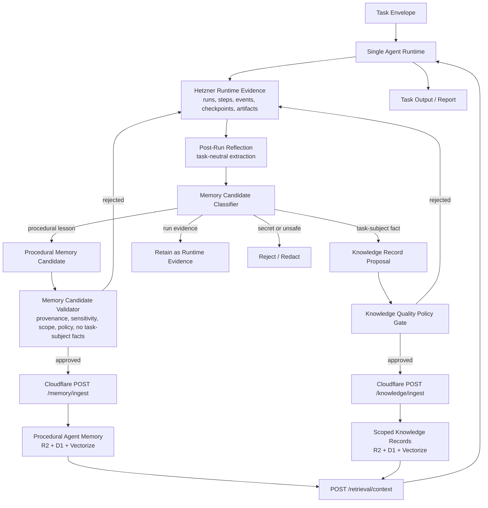

# Memory Architecture

## Purpose

This document defines the target memory architecture for SCAS. It is
task-neutral: company research, repository analysis, document synthesis,
customer support, operational diagnostics, and future task classes must all
follow the same storage and promotion boundaries.

The central rule is:

```text
Agent Memory stores reusable process lessons about how to perform tasks.
It must not store task-subject facts, source extracts, customer data, or
run-specific evidence.
```

Task-subject facts belong in scoped Knowledge Records when they must become
durable reusable factual context. Run-specific evidence belongs on the Hetzner
Runtime Plane. Agent Memory stores validated procedural lessons only.

## Current Architecture Deepdive

SCAS already separates the main infrastructure planes:

- Cloudflare Control Plane owns registries, policies, scope bindings, Knowledge
  Records, consolidated Memory Records, ingestion jobs, audit events, Vectorize
  indexes, and AI Gateway routing.
- Hetzner Runtime Plane owns runtime runs, steps, Flight Recorder events,
  checkpoints, tool invocations, validation results, memory candidates, and raw
  runtime artifacts.
- The Runtime Context Manager can retrieve only profile-selected knowledge and
  memory scopes through `POST /retrieval/context`.
- Knowledge and memory ingestion write normalized objects to R2, metadata to D1,
  and embedding jobs to the ingest queue.
- Vectorize provides semantic lookup for both knowledge and memory, but D1
  computes allowed scope IDs first and post-validates semantic matches.
- Memory Candidate Extraction and Validation already require provenance,
  acceptable sensitivity, allowed memory scope, allowed policy, and semantic
  drift guard checks before Cloudflare ingestion.

The current gap is not a missing vector store. The gap is a missing explicit
taxonomy and promotion contract that distinguishes:

- task-subject data,
- run evidence,
- durable factual knowledge,
- procedural agent memory,
- semantic retrieval as an access mechanism.

Without that taxonomy, validated memory candidates can still carry factual
task-subject content if the candidate has a summary, acceptable sensitivity, and
an allowed scope. The target architecture closes that gap.

## Memory Taxonomy

| Class | Definition | Primary Store | Durable Reuse Path |
| --- | --- | --- | --- |
| Runtime Evidence | Run-local sources, tool outputs, traces, intermediate notes, report drafts, checkpoints, and validation evidence. | Hetzner Runtime Plane artifacts and PostgreSQL metadata. | Referenced by report output or post-run reflection; not directly promoted to Agent Memory. |
| Task-Subject Data | Facts about the concrete subject of a task, such as a company, person, product, repository, document, market, customer case, legal question, or operational incident. | Hetzner Runtime Plane during a run. | Scoped Knowledge Record only when durable factual reuse is explicitly intended and policy-approved. |
| Knowledge Record | Durable factual context with source owner, source URI, sensitivity, quality metadata, scope, retention, and validation status. | Cloudflare R2, D1, and Knowledge Vectorize index. | Retrieved only through selected knowledge scopes. |
| Procedural Agent Memory | Reusable process lessons about what worked, what failed, what sequence was better, which strategy reduced risk, or which tool/source pattern should be preferred or avoided. | Cloudflare R2, D1, and Memory Vectorize index after candidate approval. | Retrieved only through selected memory scopes as non-authoritative planning or retrieval context. |
| Semantic Retrieval Signal | Embeddings and vector matches used to rank scoped knowledge or memory candidates. | Cloudflare Vectorize. | Access mechanism only; not a memory class and not an authority source. |

## Target Architecture



The target architecture keeps subject-matter content and procedural learning on
different paths:

- Runtime Evidence remains task-local and is retained or cleaned up according
  to Runtime Plane retention policy.
- Task-Subject Data is never automatically Agent Memory.
- Durable factual reuse requires a Knowledge Record path with source quality
  metadata and scope authorization.
- Agent Memory receives only procedural lessons that can be reused without
  carrying task-subject facts or customer-specific content.
- Semantic retrieval ranks only records that passed the relevant scope and
  policy gates.

## Promotion Pipeline

The post-run promotion pipeline has six gates:

1. Evidence selection chooses only completed runtime steps and their artifact
   URIs.
2. Reflection extracts candidate lessons into classified candidate envelopes
   and preserves source run/profile/step provenance. The reflection step writes
   envelope artifacts on the Hetzner Runtime Plane and does not insert directly
   into `memory_candidates`.
3. Classification labels each candidate as `procedural_lesson`,
   `task_subject_fact`, `runtime_evidence`, `knowledge_record_proposal`, or
   `rejected`. The envelope contract is
   `schemas/memory-candidate-classification.schema.json`; the persisted
   Runtime Plane row must also carry `candidate_class` and
   `classification_reason`.
4. Policy validation rejects secrets, customer-specific content in Agent
   Memory, unscoped memory targets, missing retention policy, and unsafe
   authority deltas.
5. Safety compilation rejects learned context that would grant tools, widen
   scopes, raise budgets, remove validators, relax policies, or change failure
   behavior without reviewed policy artifacts.
6. Ingestion writes only approved procedural memory records to Cloudflare
   Memory. Approved factual records use Cloudflare Knowledge ingestion instead.

## Post-Run Reflection Envelope

Post-run reflection is the first executable boundary after a runtime run
finishes. It reads completed runtime steps and artifact URIs, then emits a
classified candidate envelope. It must not directly promote records to
Cloudflare Memory.

Every envelope must include:

- `source_run_id`, `source_profile_id`, and `source_step_id`,
- at least one `evidence_uris` entry pointing to Hetzner Runtime Plane evidence,
- `candidate_class`, `classification_reason`, and `promotion_route`,
- `sensitivity`, `retention_policy`, `target_memory_scope_id`, `policy_id`,
  and `validator_id`.

Reflection rejects or reroutes unsafe content before validation:

- raw tool outputs and source extracts remain Runtime Evidence,
- secret-like content is rejected,
- customer-specific or private data cannot become Agent Memory,
- procedural lessons stay non-authoritative and may only influence planning,
  retrieval ranking, or candidate bias after later validation.

## Procedural Memory Content Contract

A procedural Agent Memory candidate should contain:

- `summary`: concise reusable process lesson.
- `applicability`: task classes or conditions where the lesson may help.
- `evidence_uris`: Hetzner artifact URIs proving the lesson.
- `source_run_id`, `source_profile_id`, and `source_step_id`.
- `sensitivity`, `retention_policy`, `policy_id`, and `validator_id`.
- `authoritative=false`.
- `influence_class`, limited to non-authoritative effects such as
  `planner_hint`, `retrieval_ranking`, or
  `composer_candidate_bias`.
- `allowed_effects` and `forbidden_effects` that make the non-authority
  boundary explicit.

It must not contain:

- task-subject facts,
- source extracts,
- raw tool outputs,
- customer or private data,
- credentials or secret-like values,
- new capability grants,
- unreviewed policy exceptions,
- generalizations that cross risk, environment, data, or memory-scope
  boundaries.

## Retrieval Semantics

Semantic retrieval is allowed for both Knowledge Records and Procedural Agent
Memory, but retrieval must remain profile-bounded:

- the active profile selects allowed `knowledge_scopes` and `memory_scopes`,
- D1 computes principal-allowed IDs before semantic lookup,
- Vectorize can rank only within allowed scope filters,
- the Worker post-validates vector matches against D1 rows,
- the Runtime Context Manager rejects any returned scope outside the active
  profile,
- retrieved memory may guide planning or ranking but must not grant authority.

## Implementation Tasks

The executable backlog derived from this target architecture lives in
`docs/roadmap/memory-architecture-backlog.md`.

The architecture decision record is
`docs/adr/0009-task-subject-data-and-procedural-memory-separation.md`.
