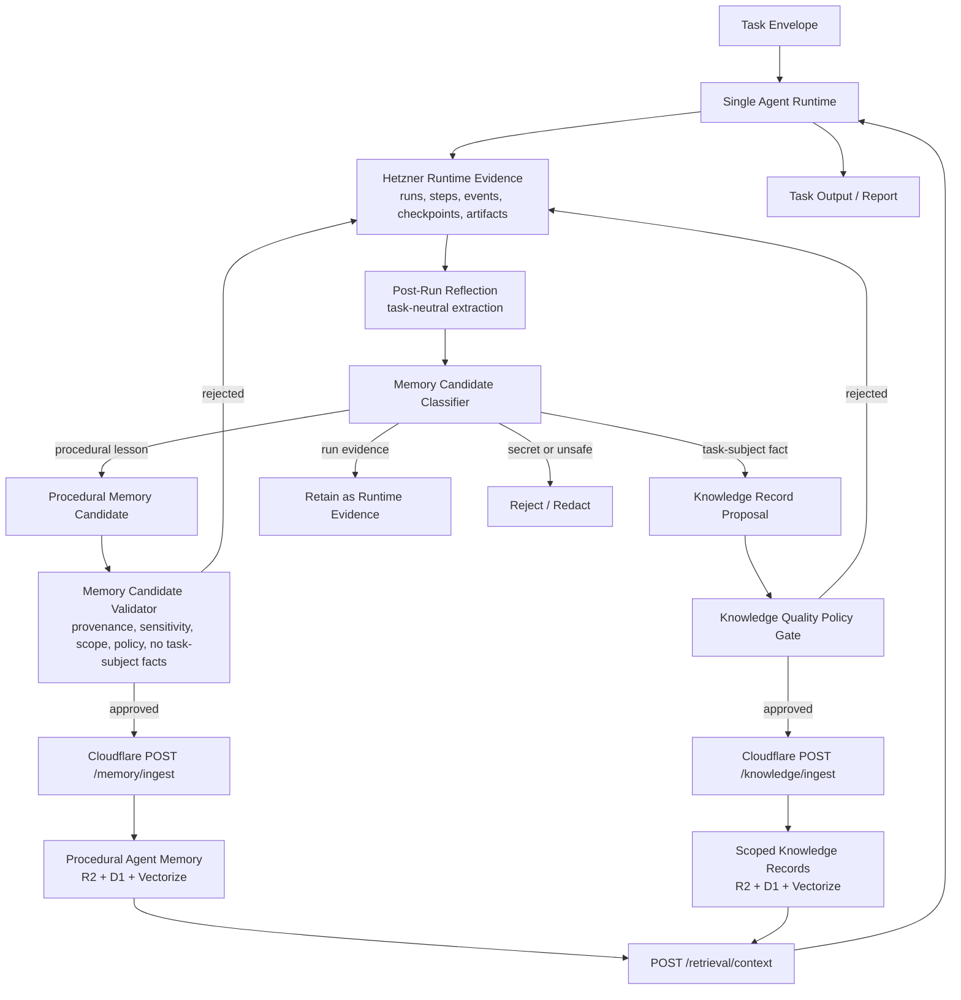

# Memory Architecture

## Purpose

This document defines the target memory architecture for SCAS. It is
task-neutral: company research, repository analysis, document synthesis,
customer support, operational diagnostics, and future task classes must all
follow the same storage and promotion boundaries.

The central rule is:

```text
Agent Memory stores reusable process lessons about how to perform tasks.
It must not store task-subject facts, source extracts, customer data, or
run-specific evidence.
```

Task-subject facts belong in scoped Knowledge Records when they must become
durable reusable factual context. Run-specific evidence belongs on the Hetzner
Runtime Plane. Agent Memory stores validated procedural lessons only.

## Current Architecture Deepdive

SCAS already separates the main infrastructure planes:

- Cloudflare Control Plane owns registries, policies, scope bindings, Knowledge
  Records, consolidated Memory Records, ingestion jobs, audit events, Vectorize
  indexes, and AI Gateway routing.
- Hetzner Runtime Plane owns runtime runs, steps, Flight Recorder events,
  checkpoints, tool invocations, validation results, memory candidates, and raw
  runtime artifacts.
- The Runtime Context Manager can retrieve only profile-selected knowledge and
  memory scopes through `POST /retrieval/context`.
- Knowledge and memory ingestion write normalized objects to R2, metadata to D1,
  and embedding jobs to the ingest queue.
- Vectorize provides semantic lookup for both knowledge and memory, but D1
  computes allowed scope IDs first and post-validates semantic matches.
- Memory Candidate Extraction and Validation already require provenance,
  acceptable sensitivity, allowed memory scope, allowed policy, and semantic
  drift guard checks before Cloudflare ingestion.

The current gap is not a missing vector store. The gap is a missing explicit
taxonomy and promotion contract that distinguishes:

- task-subject data,
- run evidence,
- durable factual knowledge,
- procedural agent memory,
- semantic retrieval as an access mechanism.

Without that taxonomy, validated memory candidates can still carry factual
task-subject content if the candidate has a summary, acceptable sensitivity, and
an allowed scope. The target architecture closes that gap.

## Memory Taxonomy

| Class | Definition | Primary Store | Durable Reuse Path |
| --- | --- | --- | --- |
| Runtime Evidence | Run-local sources, tool outputs, traces, intermediate notes, report drafts, checkpoints, and validation evidence. | Hetzner Runtime Plane artifacts and PostgreSQL metadata. | Referenced by report output or post-run reflection; not directly promoted to Agent Memory. |
| Task-Subject Data | Facts about the concrete subject of a task, such as a company, person, product, repository, document, market, customer case, legal question, or operational incident. | Hetzner Runtime Plane during a run. | Scoped Knowledge Record only when durable factual reuse is explicitly intended and policy-approved. |
| Knowledge Record | Durable factual context with source owner, source URI, sensitivity, quality metadata, scope, retention, and validation status. | Cloudflare R2, D1, and Knowledge Vectorize index. | Retrieved only through selected knowledge scopes. |
| Procedural Agent Memory | Reusable process lessons about what worked, what failed, what sequence was better, which strategy reduced risk, or which tool/source pattern should be preferred or avoided. | Cloudflare R2, D1, and Memory Vectorize index after candidate approval. | Retrieved only through selected memory scopes as non-authoritative planning or retrieval context. |
| Semantic Retrieval Signal | Embeddings and vector matches used to rank scoped knowledge or memory candidates. | Cloudflare Vectorize. | Access mechanism only; not a memory class and not an authority source. |

## Target Architecture



The target architecture keeps subject-matter content and procedural learning on
different paths:

- Runtime Evidence remains task-local and is retained or cleaned up according
  to Runtime Plane retention policy.
- Task-Subject Data is never automatically Agent Memory.
- Durable factual reuse requires a Knowledge Record path with source quality
  metadata and scope authorization.
- Agent Memory receives only procedural lessons that can be reused without
  carrying task-subject facts or customer-specific content.
- Semantic retrieval ranks only records that passed the relevant scope and
  policy gates.

## Promotion Pipeline

The post-run promotion pipeline has six gates:

1. Evidence selection chooses only completed runtime steps and their artifact
   URIs.
2. Reflection extracts candidate lessons into classified candidate envelopes
   and preserves source run/profile/step provenance. The reflection step writes
   envelope artifacts on the Hetzner Runtime Plane and does not insert directly
   into `memory_candidates`.
3. Classification labels each candidate as `procedural_lesson`,
   `task_subject_fact`, `runtime_evidence`, `knowledge_record_proposal`, or
   `rejected`. The envelope contract is
   `schemas/memory-candidate-classification.schema.json`; the persisted
   Runtime Plane row must also carry `candidate_class` and
   `classification_reason`.
4. Policy validation rejects secrets, customer-specific content in Agent
   Memory, unscoped memory targets, missing retention policy, missing
   procedural metadata, raw/source/task-subject fields, imperative authority
   language, unsafe generalization, and unsafe authority deltas.
5. Safety compilation rejects learned context that would grant tools, widen
   scopes, raise budgets, remove validators, relax policies, or change failure
   behavior without reviewed policy artifacts.
6. Ingestion writes only approved procedural memory records to Cloudflare
   Memory. Approved factual records use Cloudflare Knowledge ingestion instead.

## Post-Run Reflection Envelope

Post-run reflection is the first executable boundary after a runtime run
finishes. It reads completed runtime steps and artifact URIs, then emits a
classified candidate envelope. It must not directly promote records to
Cloudflare Memory.

Every envelope must include:

- `source_run_id`, `source_profile_id`, and `source_step_id`,
- at least one `evidence_uris` entry pointing to Hetzner Runtime Plane evidence,
- `candidate_class`, `classification_reason`, and `promotion_route`,
- `sensitivity`, `retention_policy`, `target_memory_scope_id`, `policy_id`,
  and `validator_id`.

Reflection rejects or reroutes unsafe content before validation:

- raw tool outputs and source extracts remain Runtime Evidence,
- secret-like content is rejected,
- customer-specific or private data cannot become Agent Memory,
- procedural lessons stay non-authoritative and may only influence planning,
  retrieval ranking, or candidate bias after later validation.

## Procedural Memory Content Contract

A procedural Agent Memory candidate should contain:

- `summary`: concise reusable process lesson.
- `applicability`: task classes or conditions where the lesson may help.
- `evidence_uris`: Hetzner artifact URIs proving the lesson.
- `source_run_id`, `source_profile_id`, and `source_step_id`.
- `sensitivity`, `retention_policy`, `policy_id`, and `validator_id`.
- `authoritative=false`.
- `influence_class`, limited to non-authoritative effects such as
  `planner_hint`, `retrieval_ranking`, or
  `composer_candidate_bias`.
- `allowed_effects` and `forbidden_effects` that make the non-authority
  boundary explicit.

It must not contain:

- task-subject facts,
- source extracts,
- raw tool outputs,
- customer or private data,
- credentials or secret-like values,
- new capability grants,
- unreviewed policy exceptions,
- generalizations that cross risk, environment, data, or memory-scope
  boundaries.

## Procedural Memory Validation Gate

`MemoryCandidateValidator` is the executable gate between Hetzner Runtime Plane
candidate records and Cloudflare Agent Memory ingestion. It approves only
`procedural_lesson` candidates that satisfy both record-level and content-level
requirements.

Record-level validation requires:

- source run, profile, and step provenance,
- a target memory scope allowed by the active policy context,
- a policy ID allowed by the active policy context,
- a Hetzner Runtime Plane `content_uri`,
- non-secret sensitivity,
- retention policy and validator metadata,
- `candidate_class=procedural_lesson`.

Content-level validation requires:

- a non-empty `summary`,
- non-empty `applicability` metadata,
- at least one `evidence_uris` value under `hetzner://runtime/`,
- `authoritative=false`,
- `influence_class` limited to `planner_hint`, `retrieval_ranking`, or
  `composer_candidate_bias`,
- `allowed_effects` limited to those non-authoritative effects,
- `forbidden_effects` covering `tool_grant`, `scope_grant`,
  `policy_override`, `validator_override`, `profile_mutation`, and
  `runtime_authority`.

The validator fails closed when procedural content contains raw tool output,
source extracts, customer/private fields, task-subject fact fields,
secret-like summary terms, imperative authority-changing language, or
all-task/global generalization markers. Existing semantic drift guard checks
still run for `learned_context_authority_prior` so learned context cannot
expand authority without reviewed policy artifacts.

Contrastive memory safety coverage lives in
`examples/evaluations/contrastive-memory-safety-fixtures.json` and is evaluated
through `src/skill_centric_agent_system/operations/memory_safety_evaluation.py`.
The fixture runs positive and negative cases through the existing candidate
validator, semantic drift guard, and post-planning invariant validator. It
reports false negative rate, false positive rate, abstention/review rate, and
coverage for authority-leak classes rather than creating a second authority
model.

## Knowledge Record Proposal Path

Task-subject facts that need durable reuse use a separate
`KnowledgeRecordProposal` path instead of Agent Memory. The Runtime Plane emits
a proposal artifact under `hetzner://runtime/` after a completed step, and the
proposal remains factual Knowledge input until a policy-approved Knowledge
ingest request is submitted.

Every proposal must include:

- `source_run_id`, `source_profile_id`, and `source_step_id`,
- source metadata: `source.id`, `source.name`, `source_type`, `uri`, `owner`,
  and non-secret `sensitivity`,
- document metadata: `document.id`, `version`, `content`, and `scope_id`,
- at least one Hetzner Runtime `evidence_uris` entry,
- `freshness_review_days`, `confidence_tier`, `validation_rules`, and
  `retention_policy`,
- `candidate_class=knowledge_record_proposal` and
  `promotion_route=knowledge_record_approval`.

The executable artifact contract is
`schemas/knowledge-record-proposal.schema.json`. Approved proposals can be
converted into the `POST /knowledge/ingest` body; the Worker validates the
proposal metadata again and copies it into the Knowledge manifest. The path
fails closed when owner, source URI, scope, evidence, freshness, confidence,
validation rules, retention, or non-secret sensitivity is missing.

## Memory Renderer Contract

The Runtime Context Manager keeps retrieved memory records separate from
instructions and renders them through a non-authoritative metadata wrapper
before planner use. The wrapper is intentionally redundant with validation
metadata so downstream runtime code can inspect safety semantics without
reinterpreting the original memory content.

Every rendered procedural memory record uses
`render_profile=procedural_memory_context_v1` and injects:

- `record_kind=procedural_agent_memory`,
- `instruction_status=not_an_instruction`,
- `authoritative=false`,
- `allowed_effects` limited to `planner_hint`, `retrieval_ranking`, and
  `composer_candidate_bias`,
- `forbidden_effects` covering `tool_grant`, `scope_grant`,
  `policy_override`, `validator_override`, `profile_mutation`, and
  `runtime_authority`,
- source run/profile IDs and memory scope ID.

Renderer metadata improves context clarity but is not the safety boundary.
The safety boundary remains the immutable runtime profile, retrieval scope
checks, procedural validation gate, policy gates, semantic drift guard, and
post-planning invariant validator.

## Post-Planning Memory Invariant Validator

After planning and before execution, SCAS validates any plan that used
procedural memory. The validator treats memory as a non-authoritative planning
signal only. Plans that do not use memory pass this gate unchanged.

For memory-influenced plans, `PostPlanningMemoryInvariantValidator` requires:

- `used_memory_ids` to be explicit,
- `effect` to be limited to `planner_hint`, `retrieval_ranking`, or
  `composer_candidate_bias`,
- `selection_reason` to explain why memory was relevant,
- `authority_delta` to be absent or empty.

It rejects memory-influenced plans that include or imply:

- tool grants,
- knowledge, memory, or data scope grants,
- policy overrides,
- validator overrides,
- budget changes,
- failure-policy changes,
- runtime profile patches,
- memory IDs as authority justification.

When a planned runtime profile is available, the validator compares authority
fields against the immutable runtime profile and rejects changes to tools,
knowledge scopes, memory scopes, data scopes, policies, validators, limits, or
failure policy. This keeps procedural memory from becoming a path to runtime
recomposition or authority expansion.

## Planner Lesson Selection Records

When the planner uses procedural memory, it emits a structured
Planner Memory Selection Record before execution. The record is data for
validation and attribution, not a transcript of private reasoning. It includes:

- `used_memory_ids` and `ignored_memory_ids`,
- `effect`, limited to `planner_hint`, `retrieval_ranking`, or
  `composer_candidate_bias`,
- a concise structured `selection_reason`,
- `authority_delta=[]`,
- `plan_change`,
- `authority_impact.status=none` with validator visibility,
- explicit `conflict_sets` when retrieved lessons contradict, supersede,
  duplicate, refine, or otherwise conflict.

The executable contract is
`schemas/planner-memory-selection-record.schema.json`. Selection reasons must
not contain chain-of-thought. The post-planning invariant validator remains the
hard gate that rejects any memory-derived authority change.

## Lesson Attribution And Ranking Feedback

After execution, SCAS may emit a Lesson Attribution Record that links selected
procedural memory to the observed outcome. The record is defined by
`schemas/lesson-attribution-record.schema.json` and captures:

- the source Planner Memory Selection Record,
- used and ignored memory IDs,
- a deterministic `context_fingerprint`,
- success criteria with Hetzner evidence URIs,
- error classification linkage, and
- bounded ranking or planner-hint feedback.

`build_lesson_ranking_feedback_gate` accepts only feedback that is
context-bound, uses `feedback_effect=non_authoritative_ranking_only`, keeps
`authority_delta=[]`, and references a memory ID from the original selection
record. Feedback weight deltas are capped and may affect only future ranking or
planner hints. They cannot add tools, scopes, policies, validators, budgets, or
runtime authority.

## Retrieval Semantics

Semantic retrieval is allowed for both Knowledge Records and Procedural Agent
Memory, but retrieval must remain profile-bounded:

- the active profile selects allowed `knowledge_scopes` and `memory_scopes`,
- D1 computes principal-allowed IDs before semantic lookup,
- Vectorize can rank only within allowed scope filters,
- the Worker post-validates vector matches against D1 rows,
- the Runtime Context Manager rejects any returned scope outside the active
  profile,
- `POST /retrieval/context` marks factual records with
  `record_kind=knowledge_record` and `context_kind=factual_knowledge`,
- `POST /retrieval/context` marks procedural memory with
  `record_kind=procedural_agent_memory`, `instruction_status=not_an_instruction`,
  `authoritative=false`, allowed non-authoritative effects, and forbidden
  authority effects,
- the Runtime Context Manager rejects retrieval records whose row scope or
  metadata does not match the Knowledge/Memory semantics,
- retrieved memory may guide planning or ranking but must not grant authority.

## Memory Scope Selection Semantics

Memory scope modules must describe procedural Agent Memory explicitly. They are
selection metadata for approved process lessons, not general project fact
stores. Their positive phrases should point to prior workflow decisions,
procedural lessons, or project memory as process context. Their negative
phrases must penalize task-subject storage requests such as customer records,
factual knowledge, durable facts, source extracts, raw traces, credentials, and
task-subject facts.

Runtime composition must not use memory scopes as a substitute for knowledge
scopes. For research or retrieval tasks, a Control Plane context that returns
memory scopes but no knowledge scopes fails closed rather than composing a
profile that would treat procedural memory as factual Knowledge.

## Policy Denial Ledger And Scope Closure

Repeated policy denials are tracked in a versioned Policy Denial Ledger. The
ledger is metadata-only: records use `authority_effect=deny_only` and
`non_authoritative=true`. A denial record can short-circuit redundant runtime
work when the profile, principal, denial predicate, requested authority, policy,
and closure version produce the same denial fingerprint.

Scope/policy closure tables may materialize already-approved reachability among
data, knowledge, or memory scopes. Closure entries use
`authority_effect=reachability_only` and `non_authoritative=true`; they may show
that a denied ancestor scope subsumes a requested child scope under the same
profile, principal, policy, and closure version. They must never grant tools,
scopes, policies, validators, budgets, failure behavior, memory scope access, or
runtime profile mutations.

The denial ledger is separate from procedural memory and lesson relationship
graphs. Lessons and memory records cannot inherit authority from denial records
or closure entries.

## Implementation Tasks

The executable backlog derived from this target architecture lives in
`docs/roadmap/memory-architecture-backlog.md`.

The architecture decision record is
`docs/adr/0009-task-subject-data-and-procedural-memory-separation.md`.
The policy denial ledger decision record is
`docs/adr/0010-policy-denial-ledger-and-scope-closure.md`.
